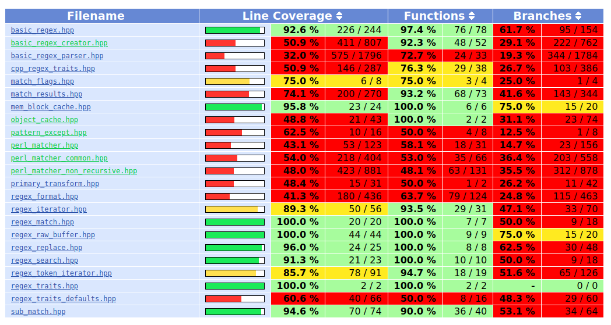
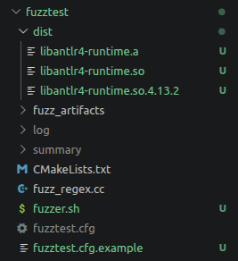
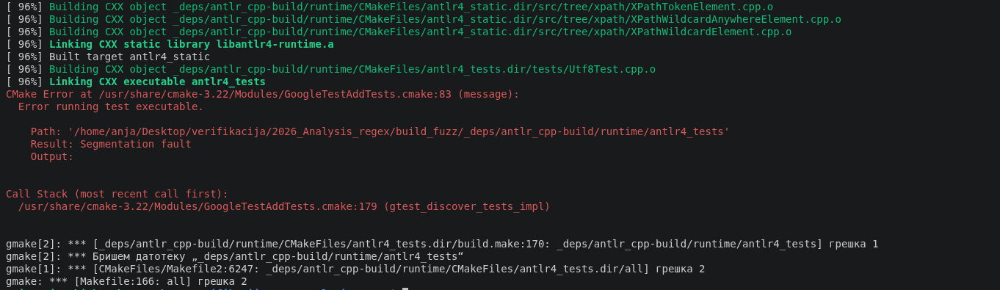
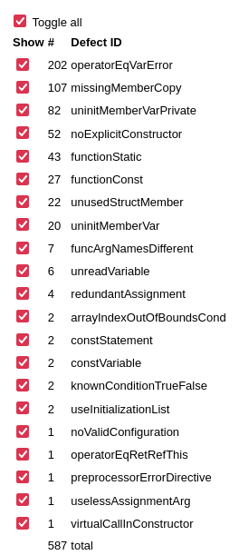

# Izveštaj analize Boost.Regex

## 1. Jedinični testovi

Za funkcionalno i API testiranje biblioteke Boost.Regex korišćen je okvir `Google Test`, uz alat `gcov\lcov` za generisanje izvetštaja o pokrivenosti.

Cilj testiranja nije samo provera funkcionalnosti parsera regularnih izraza. Značaj deo testova proverava ponašanje javnog API-ja biblioteke, tj. najznačajnijih modula poput `basic_regex`, `match_results`, `regex_match`, `regex_search` i slične.

Direktorijum `unit_tests` sadrži:
- 11 datoteka sa testovima
- sktipru `coverage.sh` za pokretanje testova sa opcijom praćenja pokrivenosti i generisanje izveštaja
- primer konfiguracione datoteke `coverage.cfg.example`
- rezultata pokretanja testova `reports/output.log` i izveštaje o pokrivenosti

### 1.1 Konfiguracija i izvršavanje

Pre pokretanja, neophodno je iskopirati datoteku `coverage.cfg.example` u `coverage.cfg` i navesti u neophodno polje `BOOST_ROOT` putanju do lokalne Boost instalacije. Ostale opcije se proizvoljne i menjaju se po potrebi. 

Pokretanjem skripte `coverage.sh` generiše se podirektorijum `reports` sa rezultatima testova `reports/output.log`. Po završetku skripte automatski se otvara izveštaj o pokrivenosti, ali ako to nije slučaj, on se može naći u `reports/html/index.html`. 
### 1.2 Organizacija i sadržaj testova 

| Datoteka | Broj testova | Glavni predmet provere |
|---|---:|---|
| `test_basic_regex.cpp` | 6 | Konstrukcija, dodela, poređenje i provera polja klase `basic_regex` |
| `test_match_results_sub_match.cpp` | 23 | `match_results`, `sub_match`, konstrukcija, kopiranje, dodela, pristup grupama i provera postuslova |
| `test_matching.cpp` | 17 | `regex_match`, `regex_search`, provera raznih konstrukcija i postuslova |
| `test_replace.cpp` | 17 | `regex_replace`, provera raznih konstrukcija i opcija za formatiranje |
| `test_iterators.cpp` | 21 | `regex_iterator`, `regex_token_iterator`, različite provere ponašanja iteratora i izdavajanja tokena |
| `test_match_flags.cpp` | 13 | Opcije za prevodjenje regularnih izraza i pronalaženja podudaranja |
| `test_groups.cpp` | 21 | Imenovane i neimenovane grupe, opcione grupe i referenciranje grupa |
| `test_character_classes_and_word_boundaries.cpp` | 13 | Klase karaktera, granice reči i linija, literali i wildcard karakter |
| `test_quantifiers_and_alternation.cpp` | 9 | Kvantifikatori, pohlepno/nepohlepno ponašanje i alternacija |
| `test_lookarounds.cpp` | 10 | Lookahead, lookbehind i atomične grupe |
| `test_regex_compilation.cpp` | 6 | Greske pri prevodjenju neispravnih regularnih izraza |


### 1.3 Rezultati

Analizom `reports/outputs.log` utvrdjuje se da je od 156 test slučajeva 156 uspešno izvršeno.

```console
[----------] Global test environment tear-down
[==========] 156 tests from 21 test suites ran. (153 ms total)
[  PASSED  ] 156 tests.
```

Izveštaj o pokrivenosti daje naredne infromacije: 

| Metrika | Pokriveno | Ukupno | Pokrivenost |
|---|---:|---:|---:|
| Linije | 2856 | 5771 | 49.5% |
| Funkcije | 583 | 790 | 73.8% |
| Grane | 1835 | 6057 | 30.3% |

Detaljnija statistika data je na slici:


Najviša pokrivenosti ostvarena je u javnim funkcijama koja testovi direktno pozivaju. Datoteke `regex_match.hpp`, `regex_search.hpp`, `regex_replace.hpp`, `regex_iterator.hpp`, `regex_token_iterator.hpp`, `basic_regex.hpp` i `sub_match.hpp` imaju veoma visoku pokrivenost linija i funkcija, što je u skladu sa predmetima testiranja. Slabiju pokrivenost imaju moduli zaduženi za parsiranje regularnih izraza, a kako je naše testiranje obuhvatilo samo osnovne konstrukte regularnih izraza ovo bismo tumačili kao solidne rezultate. Primećuje se da je porkivenost grana u svim datotekama značajno gora od ostale dve metrike, čemu doprinose i brojni izuzeci u okviru biblioteke. 

## 2. Valgrind Memcheck

Za dinamičku analizu upravljanja memorijom korišćen je alat **Memcheck**. U ovom projektu alat je pokrenut nad izvršivom datotekom `regex_tests` koja sadrži skup jedinica koda prethodno opisanih, a glavni dikretorijum alata je `valgrind/memcheck`. 

Bitan detalj je onemogućena upotreba sanitajzera, što prouzrokuje preskaknje jednog testa koji se oslenja na prisustvo santijazera adresa.

### 2.1 Konfiguracija alata 

Za pokretanje alata koristi se se skripta `valgrind/memcheck/memcheck.sh`. Pre pokretanja neophodno je iskopirati `memcheck.cfg.example` u `memcheck.cfg` i popuniti odgovarajuće vrednosti. 

### 2.2 Rezultati

Valgrind Memcheck je pokrenut sa opcijama `--leak-check=full` i `--show-leak-kinds=all` koji imaju za cilj da za svako pronađeno curenje bilo koje vrste postoji detaljan izveštja o istom. 

Rezultat pokretanja testova se može naći u `reports/run_<timestamp>/output.log` unutar direktorijuma alata. Rezultati konkretnog pokretanja dostupno na repozitorijumu na putanji `reports/run_regex_tests/output.log` pokazuju da su testovi izvršeni u skladu sa očekivanjima: od 156 testova, 155 je uspešno, dok je 1 preskočen.

```console
[----------] Global test environment tear-down
[==========] 156 tests from 21 test suites ran. (1652 ms total)
[  PASSED  ] 155 tests.
[  SKIPPED ] 1 test, listed below:
[  SKIPPED ] RegexIterator.SourceStringMustOutliveIterator
```

Primetimo da je izvšavanje znatno sporije nego kod klasičnog pokretanja testova.

Rezultati Memcheck alata se nalaze u `reports/run_<timestamp>/memcheck_regex_tests.log`, a rezultati prethodno pomenutog konkretnog pokretanja su dati `reports/run_regex_tests/memcheck_regex_tests.log`. Alat tokom izvršavanja nije detektovao ni jednu grešku u rukovanju sa memorijom što je priloženu u pomenutoj log datoteci. Njen isečak dat je u nastavku:

```console
==117433== HEAP SUMMARY:
==117433==     in use at exit: 0 bytes in 0 blocks
==117433==   total heap usage: 4,612 allocs, 4,612 frees, 928,631 bytes allocated
==117433== 
==117433== All heap blocks were freed -- no leaks are possible
==117433== 
==117433== For lists of detected and suppressed errors, rerun with: -s
==117433== ERROR SUMMARY: 0 errors from 0 contexts (suppressed: 0 from 0)
```

Eksperimenta radi, modifikovana je skripta za pokretanje alata tako da se poziva nad izvršivom datotekom `regex_app` sa argumentima `18 100`. Ovo je mala aplikacija čiji se izvorni kod može naći na putanji `src/main.cpp`. Unutar nje se pokreću tzv. zli regularni izrazi (eng. evil regex) nad dugačkim ulazima. Prvi argument `18` daje metriku za složenost ulaza regularnog izraza, a drugi argument je broj iteracija pretrage (`boost::regex_search` ili `boost::regex_match`) nad datim ulazom. Memcheck ni ovde nije našao greške. Rezultati ovog konkretnog pokretanja mogu se naći na putanji `reports/run_regex_app` a u nastavku je dat isečak memcheck izveštaja.

```console
==118136== HEAP SUMMARY:
==118136==     in use at exit: 0 bytes in 0 blocks
==118136==   total heap usage: 750 allocs, 750 frees, 197,968 bytes allocated
==118136== 
==118136== All heap blocks were freed -- no leaks are possible
==118136== 
==118136== For lists of detected and suppressed errors, rerun with: -s
==118136== ERROR SUMMARY: 0 errors from 0 contexts (suppressed: 0 from 0)
```

## 3. Google FuzzTest

Za generisanje velikog broja različitih ulaza korišćen je alat **Google FuzzTest**. Testovi su napisani u datoteci fuzz_regex.cc, dok skripta fuzzer.sh konfiguriše projekat, izgrađuje izvršivu datoteku i pojedinačno pokreće izabrane fuzz testove. Direktorijum alata je `fuzztest`. 

### 3.1 Konfiguracija alata

Za izgradnju je neophodan Clang. Vreme izvršavanja svakog testa određuje se promenljivom FUZZ_DURATION, dok se testovi koji se pokreću mogu navesti promenljivom FUZZ_TARGETS. Oba polja se definišu u okviru konfiguracionog fajla `fuzztest.cfg`, a primer jednog takvog fajla je dat u `fuzztest.cfg.example`. Konfiguracioni fajl se podešava kao i ranije. Dodatno, polje `FUZZ_TARGETS` nije neophodno, i tada će se fuzz testovi pokrenuti nad svim testovima definisanim u `fuzz_regex.cc`. Bitno je napomenuti da ovo nije preporučljivo, zbog prirode testa `MatchPattern` kojeg je najbolje pokretati odvojeno. 

### 3.2 Testovi

#### `MatchPattern`

Test koristi diferencijalno testiranje. Isti izraz i ulaz prosleđuju se bibliotekama Boost.Regex i std::regex, nakon čega se njihovi rezultati porede.

Iako obe biblioteke koriste režim označen kao ECMAScript, njihova podržana sintaksa i ponašanje nisu potpuno isti. Zbog toga različit rezultat ne mora da predstavlja grešku u Boost.Regex biblioteci.

Ovo se naročito odnosi na wildcard karakter `.` koji u boost::regex biblioteci ne može da se upati sa karakterom za novi red. Primer ovakvog odudaranja može se naći u `reports/run_parser_mismatch/output.log`. 

Da bi se donekle imitiralo ovakvo ponašanje, definisali smo opciju `boost::regex_constants::match_not_dot_newline`: 
```c++
bool matched_boost = boost::regex_match(input_str, pattern_boost, boost::regex_constants::match_not_dot_newline);
```
Ali je ovo povuklo druge probleme: nemogućnost da se upari `\f` jer se tretira kao terminator linije. Ovo ponašanje je dato u `reports/run_inverted_parser_mismatch/output.log`


#### `RegexGeneratedInputAlwaysMatches`

FuzzTest generiše adrese elektronske pošte koje odgovaraju unapred definisanom regularnom izrazu. Za ovo je korišćen poseban domen `fuzztest::InRegexp` FuzzTest alata. Zatim se proverava da li `boost::regex_match` prihvata svaki generisani string.

Ovim testom se proverava osnovna usklađenost generatora ulaza i Boost.Regex implementacije za ograničenu sintaksu izraza.

#### `FullMatchImpliesSearch`

Test generiše proizvoljan regularni izraz i proizvoljan ulazni string. Proverava se svojstvo da uspešno potpuno podudaranje pomoću `regex_match` mora da podrazumeva i uspešnu pretragu pomoću `regex_search`.

Test ne zahteva unapred poznat očekivani rezultat, već proverava logički odnos između dve funkcije biblioteke.

#### `ReplaceWithFormat`

Generišu se regularni izraz, ulazni string i format zamene. Porede se rezultati dva preopterećenja funkcije `regex_replace`.

Ako podudaranje nije pronađeno, dodatno se proverava da je ulazni string ostao nepromenjen.

#### `IteratorWalk`

Test prolazi kroz sva podudaranja pomoću klase `boost::sregex_iterator`. Za svako podudaranje proveravaju se pozicija, dužina, sadržaj i stanje grupe.

Na kraju se proverava da je iterator dostigao završnu vrednost.

### 3.3 Ograničenja testova

#### Nedostatak precizno definisane azbuke

Za većinu testova regularni izrazi se generišu pomoću domena:

```c++
fuzztest::Arbitrary<std::string>()
```

Na taj način se generišu proizvoljni karakteri, uključujući veliki broj stringova koji nisu validni regularni izrazi. Takvi ulazi izazivaju `boost::regex_error` i test ih odbacuje.

Posledica je da značajan deo generisanih ulaza ne dolazi do stvarnog izvršavanja operacija podudaranja, zamene ili iteriranja. Fuzzer zato troši deo vremena na sintaksno neispravne izraze umesto na složene, ali validne regularne izraze.

Precizniji domen mogao bi da ograniči generisanje na podržane literale, klase znakova, kvantifikatore, grupe i operatore.

#### Problem proročišta

Kod fuzz testiranja često nije moguće unapred odrediti tačan očekivani rezultat za nasumično generisani regularni izraz i ulaz.

Zbog toga testovi uglavnom proveravaju svojstva i međusobnu konzistentnost funkcija. Ipak, one ne mogu da potvrde da je svaki rezultat semantički ispravan. Dve funkcije mogu imati istu grešku i proizvesti isti rezultat, pa test takvu grešku neće pronaći.

### 3.4 Problem pronađen u alatu FuzzTest

Tokom integracije FuzzTest-a primećeno je da izgradnja alata kreira direktorijum `fuzztest/dist`

U njemu se nalaze prevedene ANTLR biblioteke:



Problem je dokumentovan u okviru [GitHub tiketa](https://github.com/google/fuzztest/issues/1898).

Direktorijum dist dodat je u .gitignore, kako generisane ANTLR biblioteke ne bi bile uključene u repozitorijum.

Jos jedan uočen problem prilikom izgradnje je `segmentation fault` greška:
 
Medjutim, nije bilo moguće reprodukoavati je. 

### 3.5 Rezultati 

Prilikom brojnih pokretanja kako pojedinačnih, tako i grupnih fuzz testova, u velikom broju slučajeva testovi bi završili uspešno. Rezultati ovakvih pokretanja se mogu naći u `reports/run_example` i `reports/run_example_without_replace`.

Međutim u značajnom broju slučajeva, dešavale bi se greške segmentacije pre nego što FuzzTest uopšte krene sa radom, o čemu svedoči log fajl u `reports/run_segfault_replace_with_format`. 

U datom slučaju test je pokrenut nad `RegexFuzz.ReplaceWithFormat`, ali ponovnim izvršavanjem dobijani su rezultati bez grešaka kao u `reports/run_success_replace_with_format`. 

Pokretanjem 

```bash
exec > >(tee -a "$REPORT_DIR/test_discovery.log") 2>&1
for run in $(seq 1 200); do
    echo "Discovery run ${run}"
    ASAN_OPTIONS="detect_leaks=1" \
    LSAN_OPTIONS="verbosity=1:log_threads=1" \
    "$BUILD_DIR/fuzz_regex" --gtest_list_tests >/dev/null || {
        echo "Crashed during test discovery"
        break
    }
done
```

je utvrđeno da do greške dođe prilikom inicijalizacije sanitajzera adresa. Output log se moež naći u `reports/run_asan_failure_at_initialization`.

Data greška je dokumentovana u okviru [tiketa](https://github.com/google/sanitizers/issues/1716). 

Jedan od navedenih rešenja jeste da se smanji randomizacija za mapiranje memorije. Na sistemu na kojem su pokrenuti testovi to je ostvareno komandom:

```bash
sudo sysctl -w vm.mmap_rnd_bits=28
```

nakon čega se ponovnim pokretanjem prethodnih komandi greška nije ispoljila. Rezultat je dat u `reports/run_asan_success_after_fix`. 

Zaista, greška se nije ponovo ispoljila ni prilikom pokretanja fuzz testova. Par uspešnih pokretanja dato je u okviru `reports` direktorijuma(`run_success_final1/2`).

U jednom od pokretanja (`reports/run_match_search_inconsistency`) je FuzzTest otkrio interesantno ponašanje:

```console
Counterexample found for RegexFuzz.FullMatchImpliesSearch.
The test fails with input:
argument 0: "\X$"
argument 1: "\000"
```

Kreiran je regresioni test koji odgovara pronađenom kontraprimeru `FullMatchImpliesSearchRegression` i on se može pokrenuti naredbom:

```bash
./build_fuzz/fuzz_regex --gtest_filter=RegexFuzz.FullMatchImpliesSearchRegression
```
Neuspešno izvršavanje testa dato je u `reports/full_match_implies_search_regression.log`.

Objašnjenje za ovo ponašanje je optimizacija koja se koristi prilikom `regex_search` za preskakanje karaktera kojima ne može početi uparivanje na početku. U `perl_matcher_common.hpp` u funkcijama `find_restart_any`, `find_restart_word` i `find_restart_line` se javljaju pozivi 

```C++
can_start(*position, _map, (unsigned char)mask_any)
```

koji dovode do ovog ponašanja, jer na osnovu argumenta `_map` koja se dobija kao rezultat poziva funkcije `get_map` iz `basic_regex.hpp` koja vraća

```C++
   unsigned char               m_startmap[1 << CHAR_BIT]; // which characters can start a match
```

Ovo polje se konstruiše u `basic_regex_creator.hpp` u funkciji `create_startmap` koja kroz `switch` naredbu obradjuje različite sintaksičke elemente definisane u nabrojivom tipu `syntax_element_type` (`states.hpp`). Ova naredba ne obradjuje `syntax_element_combining` što je upravo karakter `\X`. Prema dokumentaciji Perl sintakse dostavljene uz samu biblioteku \X predtsavlja:

```text
\X Matches a combining character sequence: that is any non-combining character followed by a sequence of zero or more combining characters. 
``` 

Ovo se ne javlja kao problem u `regex_match` jer forsira podudaranje celokupnog ulaznog stringa. Zbog toga može da upari \X i null karakter \000 (tj. \0).

Opcija `match_continuous` forsira `regex_search` da uparivanje počne od podsekvence koja počinje od prvog elementa, što bi trebalo da spreči korišćenje pomenute optimizacije. Demonstracija ove hipoteze data je kroz test `RegexFuzz.FullMatchImpliesContinuousSearch` koja se može pokrenuti komandom:
```bash  
./build_fuzz/fuzz_regex --gtest_filter=RegexFuzz.FullMatchImpliesContinuousSearch 
```
Test demonstrira da se postavljanjem pomenute opcije prilikom `regex_search` uspešno uparuju ulazni string i regularni izraz dati u kontraprimeru FuzzTesta, ali ne predstavlja i rešenje datog problema.
Uspešno pokretanje testa dato je u `reports/full_match_implies_continuous_search.log`.

Ovom tehnikom nisu pronađeni drugi bagovi Boost.Regex biblioteke, ali su definitivno testirane granice izdržljivosti autora. 

## 4. Cppcheck

Za statičku analizu izvornog koda biblioteke Boost.Regex korišćen je alat **Cppcheck**.

Analizirane su `.h` i `.hpp` datoteke iz direktorijuma:

`libs/regex/include/boost`

Rezultati su sačuvani u XML formatu, nakon čega je pomoću alata `cppcheck-htmlreport` generisan pregledan HTML izveštaj.

### 4.1 Konfiguracija alata

Kao i ranije, `cppcheck.cfg.example` treba iskopirati u `cppcheck.cfg` i popuniti lokalne vrednosti, samo što treba obratiti pažnju da se `BOOST_SOURCE_ROOT` prosleđuje putanja ka izvornom kodu Boost repozitorijuma. 

Alata je pokrenut sa narednim opcijama:

```bash
cppcheck \
    -j "$JOBS" \
    --enable=all \
    --inconclusive \
    --language=c++ \
    --std=c++20 \
    --force \
    --platform=unix64 \
    --xml \
    --xml-version=2 \
    -DBOOST_REGEX_MODULE_EXPORT="" \
    -I"$BOOST_REGEX_SRC_DIR" "${BOOST_REGEX_FILES[@]}" \
    2>"$XML_FILE"
```
Opcija `--enable=all` uključuje sve dostupne kategorije provera (osim `unusedFunction` zbog korišćenja `-j` opcije), dok `--inconclusive` uključuje i nalaze za koje alat nema potpunu sigurnost. Opcija `--force` zahteva analizu većeg broja mogućih pretprocesorskih konfiguracija, koja je uključena jer je izvorni kod bogat makroima.

Analiza je prilagođena Linux platformi sa 64-bitnom arhitekturom i standardom C++20.

Opcija `-DBOOST_REGEX_MODULE_EXPORT=""` je korišćena iz razloga što alat nije bio u mogućnosti da razreši dati makro, te je prijavljen značajan broj grešaka slične narednoj:

```text
BOOST_REGEX_MODULE_EXPORT template <class charT><--- There is an unknown macro here somewhere. Configuration is required. If BOOST_REGEX_MODULE_EXPORT is a macro then please configure it.
```

### 4.2 Rezultati

Jedno konkretno pokretanje je dostupno unutar `reports` direktorijuma gde su dostupni izveštaj u html i xml formatu. 

| Kategorija | Broj nalaza | 
|---|---:|
| `error` | 1 |
| `warning` | 186 |
| `style` | 91 |
| `performance` | 2 |
| `information` | 1 |
| **Ukupno** | 587 |

Ukupan broj nalaza obuhvata i one označene sa __inconclusive__, kojih ima 306. 

Zbog složenosti pretprocesorskih direktiva `config.hpp` nije analiziran.

Vrste defekata po brojnosti su date na nerdnoj slici preuzetoj iz izveštaja:



Prve tri vrste u potpunosti potiču iz `perl_matcher.hpp`, i to u velikoj meri od linija 572 i 576. Ovo je posledica šablona, tj. alat isto upozorenje ponavlja za više instancinacija.

Verovatno najozbiljni nalaz predstavlja `arrayIndexOutOfBoundsCond` u `unicode_iterator.hpp` na linijama 189 i 457. Cppcheck poruku formuliše uslovno: ili je uslov suvišan ili je moguć pristup van granica.

```text
Either the condition 'm_current==2' is redundant or the array 'm_values[3]' is accessed at index 3, which is out of bounds.
```

Ovo nije potvrdjeni defekt i zahteva dodatnu ručnu analizu sa najvišim prioritetom. 

Postoji veliki broj upozorenja označenih kao `inconclusive` tipa `missingMemberCopy` a odnose se na konstruktor kopije u `perl_matcher.hpp` (linija 576). Slično za operator dodele na liniji 572 se javlja veliki broj upozorenja tipa `operatorEqVarError`. Ovo bi možda bile ozbiljne stavke na razmatranje da pre definisanja ove dve funkcije ne postoji komentar:

```C++
    // these operations aren't allowed, so are declared private,
    // bodies are provided to keep explicit-instantiation requests happy:
```

Pored ovih nalaza, postoje i brojni nalazi kategorije `style` i `performance`, a detalji se mogu naći u izveštaju na putanju `cppcheck/reports/run_final`.

## 5. Perf

